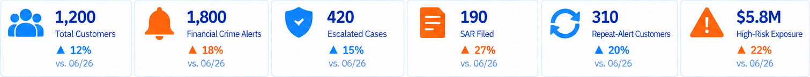
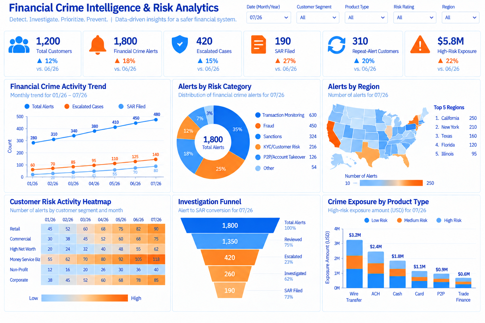
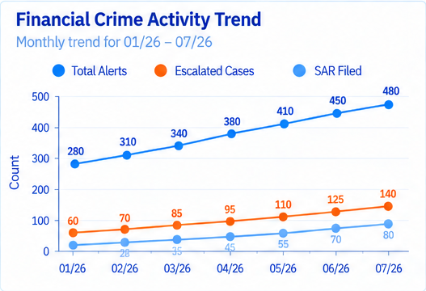
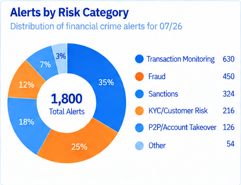
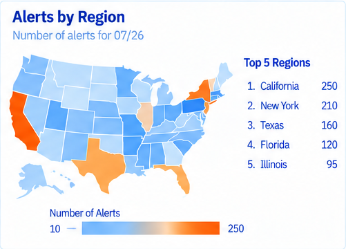
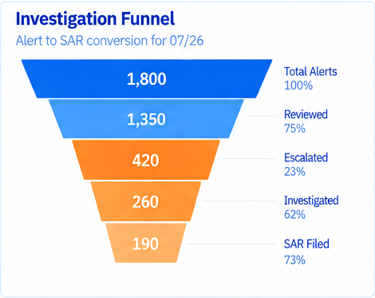

# Financial Crime Intelligence & Risk Analytics

**Project 7 — Financial Crime Analyst Portfolio**

This project connects AML, fraud, sanctions and KYC/EDD risk signals into a broader customer-level financial-crime view. It complements Projects 1–6 rather than rebuilding their individual workflows.

## Scale
- 1,200 synthetic customers
- 30,000 synthetic transactions
- 1,800 financial-crime alerts
- 420 escalated cases
- 6,440 counterparties analyzed

## Business Questions
- Which customers have multiple financial-crime indicators?
- Which customers repeatedly generate alerts?
- Which risk categories and drivers create the greatest exposure?
- Which customers combine high transaction exposure with elevated financial-crime risk?
- Which counterparties connect multiple customers and deserve analyst review?
- Where is risk concentrated by segment and time?

## Tools
SQL, Python, Tableau, Streamlit.

## KPI Scorecard
1. Total Customers
2. Financial Crime Alerts
3. High-Risk Customers
4. Escalated Cases
5. Repeat-Alert Customers
6. High-Risk Exposure

## Executive Dashboard — 6 Visualizations
1. Financial Crime Risk Trend
2. Financial Crime Risk Categories
3. Top 5 Financial Crime Risk Drivers
4. Risk Activity Heatmap
5. Customer Risk vs Transaction Exposure
6. Repeat-Alert & Multi-Risk Customers

Dashboard colors: blue + orange. Dates use MM/YY such as 07/26.

## Dashboard Preview

The visuals below come directly from the approved executive dashboard and summarize the project's main financial-crime intelligence findings.

### KPI Scorecard

**What it represents:** Provides a quick view of total customers, financial-crime alerts, escalated cases, SAR filings, repeat-alert customers, and high-risk exposure.

### Executive Dashboard

**What it represents:** Combines financial-crime trends, risk categories, geographic exposure, customer-risk activity, investigation outcomes, and product exposure in one executive view.

### Financial Crime Activity Trend

**What it represents:** Tracks monthly alerts, escalated cases, and SAR filings to show how financial-crime activity and investigative outcomes change over time.

### Alerts by Risk Category

**What it represents:** Shows how alerts are distributed across Transaction Monitoring, Fraud, Sanctions, KYC/Customer Risk, P2P/Account Takeover, and other risk categories.

### Alerts by Region

**What it represents:** Highlights where financial-crime alerts are concentrated geographically and identifies the regions generating the highest alert volumes.

### Investigation Funnel

**What it represents:** Shows how alerts move from initial detection through review, escalation, investigation, and SAR filing.

## Resume Bullets
**Financial Crime Intelligence & Risk Analytics | SQL, Python, Tableau, Streamlit**
- Integrated synthetic AML, fraud, sanctions, KYC/EDD, customer, transaction and case data to identify repeat-alert customers, multi-risk exposure, high-risk geographic activity and investigation priorities across 1,200 customers.
- Developed SQL and Python analytics for cross-domain risk indicators, customer prioritization and common-counterparty analysis, then built Tableau and Streamlit reporting for financial-crime trends, risk concentration and escalation monitoring.

## Interview Explanation
“I built this project to move beyond analyzing one type of financial-crime alert at a time. I combined customer, transaction, AML, fraud, sanctions and KYC/EDD risk signals to identify repeat-alert and multi-risk customers. I used SQL for investigation and aggregation, Python for feature engineering and an explainable customer-risk score, Tableau for portfolio-level reporting, and Streamlit for customer-level review. I kept the project at the analyst level rather than claiming production fraud models or automated compliance decisioning.”

## Disclaimer
All customers, transactions, alerts and cases are synthetic and created for educational portfolio use only.

## Preferred Dashboard Chart Types
The Project 7 executive dashboard uses exactly six chart types:
1. Trend lines
2. Bar chart
3. Donut chart
4. Geographic exposure map
5. Heatmap
6. Funnel chart

All analytical marks use blue and orange on a white background.

## Final Approved Dashboard
The final executive dashboard uses the approved blue-and-orange design with six visuals:
1. Financial Crime Activity Trend
2. Alerts by Risk Category
3. Alerts by Region
4. Customer Risk Activity Heatmap
5. Investigation Funnel
6. Crime Exposure by Product Type

The map replaces the earlier geographic exposure chart, the funnel uses a true descending funnel design, and the product exposure view uses stacked bars.

# Tableau Story Expansion

Project 7 now includes an **8-point Tableau Story** in addition to the executive dashboard:

1. Executive Overview
2. Financial Crime Risk Trends
3. Customer Risk Segmentation
4. Geographic / Regional Risk
5. Product & Channel Exposure
6. Investigation Funnel
7. Repeat-Alert & Counterparty Intelligence
8. Key Findings & Recommended Actions

Visual references are stored under `images/story/`, and the build instructions are in `tableau/TABLEAU_STORY_BUILD_GUIDE.md`.

Additional processed data tables support the story:
- `product_exposure_summary.csv`
- `regional_risk_summary.csv`
- updated `cases.csv` with investigation outcomes

The story is designed to show how a Financial Crime Analyst moves from broad portfolio signals to investigation priorities and actionable recommendations.
